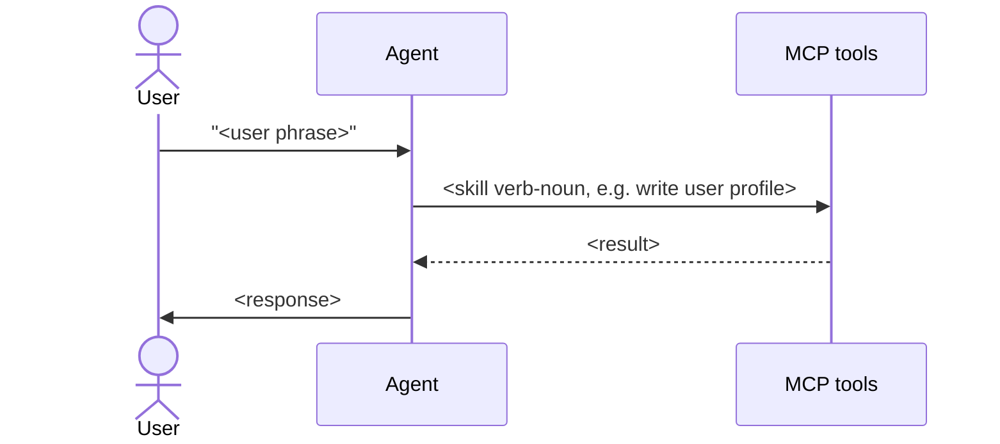

# Output schemas

Exact shapes for every file the skill produces in v2. Treat as a contract: the
templates in `assets/templates/` and the lint rules in
`references/lint-contract.md` enforce these schemas.

Schema version: `2`. v1 layouts (with `capabilities/` and `tools-proposed.json`)
are no longer produced.

## `AGENTS.md`

````markdown
---
schema_version: 2
generated_by: flow-map-compiler
generated_at: <ISO8601>
generated_from_sha: <git-sha>
app_name: <name>
stack: { framework: <framework-id>, version: "<v>", router: app|pages|both|none|filesystem|none, language: ts|js }
counts: { skills: <n>, flows: <n>, endpoints: <n> }
freshness: { last_verified: <ISO8601>, staleness_check: weekly }
files:
  app_context: APP.md
  glossary: glossary.md
  skills_dir: skills/
  flows_dir: flows/
  endpoints_dir: endpoints/
---

# <App name> — flow map

<one-paragraph LLM-authored summary of the app>

## Reading order for agents

1. Load APP.md once per session.
2. For "I want to do X" → load `skills/<id>.md` (primary read — domain context).
3. For "what triggered this UI" / behavior questions → load `flows/<id>.md`.
4. For "what HTTP call is this and what's its shape" → load `endpoints/<id>.md`.
5. `glossary.md` is the one-page pivot, not a primary read.

## Overview


## Skills

| skill | file | suggests N endpoints |
|---|---|---|

## Flows

| id | file | what it does |
|---|---|---|

## Endpoints

| id | method | path | used by skills |
|---|---|---|---|

## Note on endpoint and tool naming

Endpoint ids referenced throughout this wiki are **proposed** — derived from
frontend call sites. They become MCP tool names downstream; the bundle and the
runtime agent refer to them as *tools*. Inside `.flow-map/`, they are always
*endpoints*.

## Unresolved

<count and pointer to flows with unresolved call sites>
````

## `APP.md`

````markdown
---
schema_version: 2
framework: { name: <framework-id>, version: "<v>", router: app|pages|both|none }
api_clients: [<list>]
api_base_url: { source: env|hardcoded, name: <ENV_VAR>, default: "<url>" }
auth: { type: bearer|cookie|none, token_source: <where>, refresh: <how> }
providers: [<name>, <scope>]
---

# App context

<!-- AGENT id="overview" -->
<2–3 sentences: what this app is>
<!-- /AGENT -->

## Stack
<bullets>

## Invariants
<numbered list — properties true everywhere in the system>

## Auth model
<where tokens come from, how attached, refresh, 401 behavior>

## Conventions
<patterns repeated across flows so flow files don't repeat them>

## Provider hierarchy
<optional Mermaid flowchart TD if non-trivial>

## Boundaries
<numbered list — things the agent must never do>

<!-- HUMAN id="extra-context" -->
<!-- /HUMAN -->
````

## `glossary.md`

````markdown
---
schema_version: 2
---

# Glossary

One row per agent skill. For per-skill body (preconditions, examples,
failure modes), open the skills file linked in the first column.

| Skill | User phrases | Suggested endpoints | Flows |
|---|---|---|---|
| [<kebab-case-id>](skills/<id>.md) | "<phrase>", "<phrase>" | [`<endpoint.id>`](endpoints/<endpoint-id>.md), ... | [<flow-id>](flows/<flow-id>.md), ... |

<!-- HUMAN id="glossary-additions" -->
<!-- /HUMAN -->
````

## `skills/<id>.md`

A v2 skill is a **business-domain specialty** of the agent — coarser than a
single backend endpoint. Each skill suggests a set of endpoints (advisory; aikdm
makes the final decision on tool wiring downstream). The runtime agent loads
this file via the `Skill` meta-tool when its current intent matches the domain.

````markdown
---
schema_version: 2
id: <kebab-case>                          # e.g. shopping
name: <human-readable>                    # "Shopping"
domain: "<one-line domain summary>"
description: "Use when <trigger condition>"
user_phrases:
  - "<verbatim phrase a user might say>"
  - "..."
suggested_endpoints:
  - endpoint: <endpoint-id>               # e.g. products.list
    role: read|write|side-effect
    when: "<one-line trigger>"
flows_using_this: [<flow-id>, ...]
confidence: high|medium|low
---

# <Skill name>

<!-- AGENT id="overview" -->
<2–3 sentences: what business domain this skill owns and when the agent reaches for it>
<!-- /AGENT -->

## When to use

<trigger phrases + plain-language description of the situation that should make
the agent load this skill>

## Domain vocabulary

<2–6 bullets defining domain concepts the agent must understand to choose
between the suggested endpoints — e.g. for `shopping`: "order is owned by one
user", "cart is local-only until placed", etc.>

## Endpoint selection guide

<paragraph or numbered list mapping user intent to a specific suggested
endpoint. Endpoint ids appear as inline-code references; never include HTTP
detail (method, path, params). For full detail, link to `endpoints/<id>.md`.>

## Failure modes

| Result | Meaning | What to do |
|---|---|---|

## Flows that surface this skill

- [<flow-id>](../flows/<flow-id>.md) — <one-line context>

<!-- HUMAN id="notes" -->
<!-- /HUMAN -->
````

Hard constraints carried by the schema:

- **No HTTP detail in skill files.** Method, path, params live only in `endpoints/<id>.md`.
- **The runtime word `tool` never appears in skill files** (prose or frontmatter).
- **`suggested_endpoints[]` is advisory** — aikdm may add, drop, or re-annotate when wiring tools downstream.

## `flows/<id>.md`

Flow files are endpoint-reference-free. They reference **skills** by id. The
skill's `suggested_endpoints[]` frontmatter field is the indirection layer —
when endpoint ids change, flows do not change.

````markdown
---
schema_version: 2
id: <kebab-case>
name: <human-readable>
description: "Use when <trigger condition>"
intent: "<one sentence>"
user_phrases:
  - "<verbatim phrase a user might say>"
  - "..."
entry: <relative source path>
trigger: <UI event or condition>
preconditions:
  - <numbered system state requirement>
skills_used:
  - skill: <kebab-case-skill-id>
    skill_ref: ../skills/<skill-id>.md
postconditions:
  - <what's true after>
side_effects: [<list>]
related_flows: [<id>, ...]
confidence: high|medium|low
workflow: |
  flowchart TD
    start([start]) --> <node-id>[<skill-id>]
    <node-id> --> end([end])
---

# <Flow name>

<!-- AGENT id="prose" -->
<2–4 sentences>
<!-- /AGENT -->

## Entry point
<file path + how it's reached>

## How the agent handles this

1. <step referring to skills as markdown links, e.g.
   [write user profile](../skills/write-user-profile.md). Never name
   a tool, never show HTTP method or URL path.>
2. ...

## Decision points

- **<condition>** → <what to do>

## Sequence



## Failure modes

| What happens | What it means | What to do |
|---|---|---|

## Skills used
- [<label>](skills/<id>.md)

<!-- HUMAN id="extra" -->
<!-- /HUMAN -->

## Unresolved
<list of call sites that couldn't be statically resolved; empty if none>
````

### Workflow notation

The `workflow:` frontmatter field on every flow is a multiline mermaid
`flowchart` block describing the flow's control flow. It is the
authoritative structured representation of the flow's algorithm; the
prose body remains for human readers.

Required node shapes (do not invent new ones):

| Shape      | Mermaid syntax    | Meaning                              |
|------------|-------------------|--------------------------------------|
| Start      | `id([start])`     | Single entry node, label = `start`   |
| End        | `id([end])`       | Terminal node(s), label = `end`      |
| Skill call | `id[<skill-id>]`  | Invokes the named agent skill        |
| Decision   | `id{<question?>}` | Two-way branch                       |

Required edge shapes:

| Shape         | Mermaid syntax       |
|---------------|----------------------|
| Plain         | `a --> b`            |
| Labeled       | `a -- yes --> b`     |

**Forbidden** (the downstream editor's parser rejects them): parallel-fanout
shapes (`id{{label}}`), `&`-joined fanouts (`a & b --> c`), and pipe-delimited
edge labels (`a -->|yes| b`). Express parallel awaits as a serial sequence in
declared order; express fanouts as separate plain edges.

Every `id[<skill-id>]` skill node's label MUST equal a `skills_used[].skill`
entry on the same flow. Loops are modeled as back-edges between existing
nodes — no dedicated node type. When call-site control flow can't be
determined (low-confidence fallback), emit a linear chain through
`skills_used` in declared order:

```
flowchart TD
  s_<a> --> s_<b> --> s_<c>
```

## `endpoints/<id>.md`

The complete inventory of backend HTTP calls discovered in the source repo. One
file per `(method, path)`. May be referenced by skills via `suggested_endpoints[]`
or may stand alone (`used_by_skills: []`).

````markdown
---
schema_version: 2
id: <endpoint-id>                          # e.g. products.list (dotted-lower-camel, stable across regenerations)
proposed: true                             # always true; v2 never emits proposed: false
method: GET|POST|PUT|PATCH|DELETE|HEAD|OPTIONS
path: "<path with {params}>"
path_params: [{ name: <p>, type: <t>, required: true|false }, ...]
query_params: [{ name: <q>, type: <t>, required: true|false }, ...]
body_shape: <typed shape or null>
response_shape: <typed shape or "unknown">
auth: bearer|cookie|none
source: <relative source file>:<line>
used_by_skills: [<skill-id>, ...]          # may be empty
confidence: high|medium|low
openapi_operation_id: <string or null>
---

# <endpoint-id>

<!-- AGENT id="overview" -->
<1–2 sentences: what this endpoint does in business terms>
<!-- /AGENT -->

## Request
**HTTP:** `METHOD /path/with/{params}`
**Auth:** bearer|cookie|none
**Path params:** <list or none>
**Query params:** <list or none>
**Body shape:** <typed shape or `null`>

## Response
**Response shape:** <typed shape or `unknown`>

## Notes
<2–4 sentences: observed call sites, sample call, edge cases, common failure modes>

<!-- HUMAN id="notes" -->
<!-- /HUMAN -->
````

Hard constraints:

- **`endpoints/` is the complete inventory.** Every discovered backend call appears here whether or not a skill suggests it.
- **`used_by_skills: []` is valid.** Endpoint-only entries are still callable by the runtime agent directly.
- **No `tool:` field anywhere in `.flow-map/`.** The endpoint id is the canonical reference; downstream calls it a tool.
