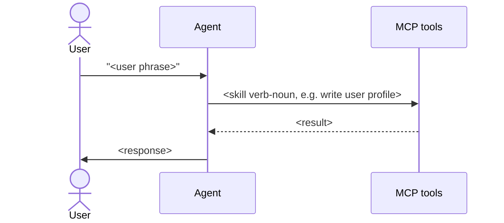

# Output schemas

Exact shapes for every file the skill produces. Treat as a contract: the
templates in `assets/templates/` and the lint rules in
`references/lint-contract.md` enforce these schemas.

## `AGENTS.md`

````markdown
---
schema_version: 1
generated_by: flow-map-compiler
generated_at: <ISO8601>
generated_from_sha: <git-sha>
app_name: <name>
stack: { framework: <framework-id>, version: "<v>", router: app|pages|both|none, language: ts|js }
counts: { skills: <n>, flows: <n>, capabilities: <n>, proposed_tools: <n> }
freshness: { last_verified: <ISO8601>, staleness_check: weekly }
files:
  app_context: APP.md
  glossary: glossary.md
  skills_dir: skills/
  flows_dir: flows/
  capabilities_dir: capabilities/
  proposed_tools: tools-proposed.json
---

# <App name> — flow map

<one-paragraph LLM-authored summary of the app>

## Reading order for agents

An *agent skill* here is a navigable file describing one tool the
agent can invoke — not the same as a Claude Code SKILL.md plugin.

1. Load APP.md once per session.
2. For "I want to do X" → load skills/<id>.md (the primary
   reading unit).
3. For "what triggered this UI" / behavior questions → load
   flows/<id>.md.
4. For "how do I implement the MCP server for resource Y" →
   load capabilities/<name>.md.
5. glossary.md is the one-page index, not a primary read.

## Overview


## Skills

| skill | file | proposed tool |
|---|---|---|

## Flows

| id | file | what it does |
|---|---|---|

## Capabilities

| name | file | proposed tools |
|---|---|---|

## Note on tool names

Tool names referenced throughout this wiki are *proposed* — derived from
frontend call sites. The actual MCP server does not exist yet. See
`tools-proposed.json` for the full machine-readable list.

## Unresolved

<count and pointer to flows with unresolved call sites>
````

## `APP.md`

````markdown
---
schema_version: 1
framework: { name: <framework-id>, version: "<v>", router: app|pages|both|none }
api_clients: [<list>]
api_base_url: { source: env|hardcoded, name: <ENV_VAR>, default: "<url>" }
auth: { type: bearer|cookie|none, token_source: <where>, refresh: <how> }
providers: [<name>, <scope>]
---

# App context

<!-- AGENT id="overview" -->
<2–3 sentences: what this app is>
<!-- /AGENT -->

## Stack
<bullets>

## Invariants
<numbered list — properties true everywhere in the system>

## Auth model
<where tokens come from, how attached, refresh, 401 behavior>

## Conventions
<patterns repeated across flows so flow files don't repeat them>

## Provider hierarchy
<optional Mermaid flowchart TD if non-trivial>

## Boundaries
<numbered list — things the agent must never do>

<!-- HUMAN id="extra-context" -->
<!-- /HUMAN -->
````

## `glossary.md`

A thin one-page pivot table that lists every skill alongside its
capability and proposed tool. Per-skill body lives in
`skills/<id>.md`; glossary is the catalog only.

````markdown
---
schema_version: 1
---

# Glossary

One row per agent skill. For per-skill body (preconditions, examples,
failure modes), open the skills file linked in the first column.

| Skill | User phrases | Capability | Proposed tool |
|---|---|---|---|
| [<kebab-case-id>](skills/<id>.md) | "<phrase>", "<phrase>" | [<name>#<anchor>](capabilities/<name>.md#<anchor>) | `<tool.name>` |

<!-- HUMAN id="glossary-additions" -->
<!-- /HUMAN -->
````

## `skills/<id>.md`

Skills are the **primary reading unit for the runtime agent**. Each
file describes one tool the agent can invoke: when to reach for it,
its trigger phrases, the capability it executes, and which flows
surface it. The frontmatter `proposed_tool` field is the indirection
layer — when the MCP server lands and tools get renamed, only this
field changes; flow files stay byte-identical because flows link to
`skills/<id>.md`, not to the tool name.

> Note: an *agent skill* (this file) is not the same as a Claude
> Code SKILL.md plugin. Different concept, same word. Context
> disambiguates inside generated content.

````markdown
---
schema_version: 1
id: <kebab-case>                            # e.g. write-user-profile
name: <human-readable>                      # "Update user profile"
description: "Use when <trigger condition>"
user_phrases:
  - "<verbatim phrase a user might say>"
  - "..."
role: load|read|write|side-effect
capability_ref: capabilities/<name>.md#<anchor>
proposed_tool: <tool.name>
flows_using_this: [<flow-id>, ...]
confidence: high|medium|low
---

# <Skill name>

<!-- AGENT id="overview" -->
<2–3 sentences: what this skill does for the agent>
<!-- /AGENT -->

## When to use

<trigger phrases + plain-language description of the situation
that should make the agent reach for this skill>

## Preconditions

1. <numbered list — system state that must be true before invoking>

## Flows that surface this skill

- [<flow-id>](../flows/<flow-id>.md) — <one-line context>

## Failure modes

| Result | Meaning | What to do |
|---|---|---|

## Examples

<2–3 worked invocations: user phrase → expected tool-call shape.
The tool name appears here as a *proposed* name; do not commit to
the exact arguments until the MCP server is live.>

<!-- HUMAN id="notes" -->
<!-- /HUMAN -->
````

## `flows/<id>.md`

Flow files are tool-name-free. They reference **skills** by id. The
skill's `proposed_tool` frontmatter field is the indirection — when
tools get renamed, flows do not change.

````markdown
---
schema_version: 1
id: <kebab-case>
name: <human-readable>
description: "Use when <trigger condition>"
intent: "<one sentence>"
user_phrases:
  - "<verbatim phrase a user might say>"
  - "..."
entry: <relative source path>
trigger: <UI event or condition>
preconditions:
  - <numbered system state requirement>
skills_used:
  - skill: <kebab-case-skill-id>
    role: load|read|write|side-effect
    skill_ref: ../skills/<skill-id>.md
postconditions:
  - <what's true after>
side_effects: [<list>]
related_flows: [<id>, ...]
confidence: high|medium|low
---

# <Flow name>

<!-- AGENT id="prose" -->
<2–4 sentences>
<!-- /AGENT -->

## Entry point
<file path + how it's reached>

## How the agent handles this

1. <step referring to skills as markdown links, e.g.
   [write user profile](../skills/write-user-profile.md). Never name
   a tool, never show HTTP method or URL path.>
2. ...

## Decision points

- **<condition>** → <what to do>

## Sequence



## Failure modes

| What happens | What it means | What to do |
|---|---|---|

## Skills used
<bullet list of skill ids, each linking to
 skills/<id>.md>

<!-- HUMAN id="extra" -->
<!-- /HUMAN -->

## Unresolved
<list of call sites that couldn't be statically resolved; empty if none>
````

## `capabilities/<name>.md`

````markdown
---
schema_version: 1
capability: <name>
summary: "<one sentence>"
tools:
  - tool: <tool.name>
    proposed: true
    does: "<one-line semantic description>"
    method: GET|POST|PUT|PATCH|DELETE|HEAD|OPTIONS
    path: "<path with {params}>"
    auth: bearer|cookie|none
    confidence: high|medium|low
    source: <relative source file>:<line>
flows_using_this: [<flow-id>, ...]
---

# <Capability name>

<!-- AGENT id="overview" -->
<what this resource represents in the domain; constraints and invariants>
<!-- /AGENT -->

## Concepts the agent must know
<bullets>

## When to reach for which tool

- "<user intent phrase>" → `<tool.name>`

---

## <tool.name>  {#<anchor>}

**Proposed tool name:** `<tool.name>` (proposed — no MCP server yet)
**HTTP:** `METHOD /path/with/{params}`
**Auth:** bearer|cookie|none
**Confidence:** high|medium|low
**Source:** `<file>:<line>`

**Path params:** <list or none>
**Query params:** <list or none>
**Body shape:** <typed shape or `unknown`>
**Response shape:** <typed shape or `unknown`>

**When to call it:** <2–3 user intent phrases>

**Used by flows:** <links to flow files>

---

## Things this capability cannot do
<bullets>

<!-- HUMAN id="notes" -->
<!-- /HUMAN -->
````

## `tools-proposed.json`

````json
{
  "schema_version": 1,
  "generated_by": "flow-map-compiler",
  "generated_at": "<ISO8601>",
  "generated_from_sha": "<git-sha>",
  "naming_convention": "dotted-lower-camel",
  "tools": [
    {
      "proposed_name": "users.update",
      "method": "PATCH",
      "path": "/api/users/{id}",
      "path_params": [{ "name": "id", "type": "string", "required": true }],
      "query_params": [],
      "body_shape": { "name": "string", "email": "string" },
      "response_shape": "User",
      "auth": "bearer",
      "capability_file": "capabilities/users.md",
      "anchor": "users-update",
      "source": [
        { "file": "lib/api/users.ts", "line": 17 }
      ],
      "used_by_flows": ["update-profile"],
      "confidence": "high",
      "openapi_operation_id": "updateUser"
    }
  ],
  "unresolved": [
    {
      "where": "components/Search.tsx:88",
      "snippet": "fetch(`/api/search?q=${query}&type=${type}`)",
      "reason": "type variable not statically resolvable"
    }
  ]
}
````
