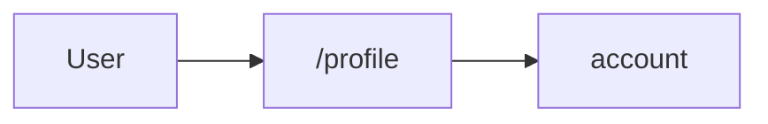

# sample-nextjs — flow map

<!-- AGENT id="summary" -->
A minimal Next.js App Router application with one user-facing flow: profile editing. The agent surface is one route at /profile and one write skill against the user record.
<!-- /AGENT -->

## Reading order for agents

1. Load APP.md once per session.
2. For "I want to do X" → load `skills/<id>.md` (primary read — domain context).
3. For "what triggered this UI" → load `flows/<id>.md`.
4. For "what's the HTTP shape of call Y" → load `endpoints/<id>.md`.
5. `glossary.md` is the one-page pivot, not a primary read.

## Overview

## Skills

| skill | file | suggests N endpoints |
|---|---|---|
| account | [skills/account.md](skills/account.md) | 1 |

## Flows

| id | file | what it does |
|---|---|---|
| update-profile | [flows/update-profile.md](flows/update-profile.md) | Persist the user's edited profile fields to the backend |

## Endpoints

| id | method | path | used by skills |
|---|---|---|---|
| `users.update` | PATCH | `/api/users/{id}` | account |

## Note on endpoint and tool naming

Endpoint ids referenced throughout this wiki are **proposed** — derived from
frontend call sites. They become MCP tool names downstream; the bundle and the
runtime agent refer to them as *tools*. Inside `.flow-map/`, they are always
*endpoints*.

## Unresolved

None.

<!-- HUMAN id="agents-extra" -->
<!-- /HUMAN -->
