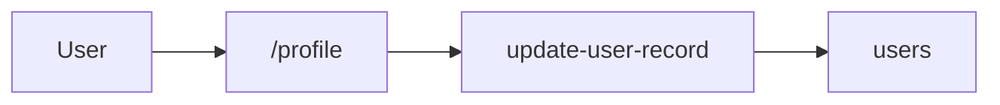

# sample-nextjs — flow map

<!-- AGENT id="summary" -->
A minimal Next.js App Router application with one user-facing flow: profile editing. The agent surface is one screen at /profile and one write skill against the user record.
<!-- /AGENT -->

## Reading order for agents

An *agent skill* below is one navigable file describing a tool the
agent can invoke — not the same as a Claude Code SKILL.md plugin.

1. Load APP.md once per session.
2. For "I want to do X" → load `skills/<id>.md` (primary read).
3. For "what triggered this UI" → load `flows/<id>.md`.
4. For "how do I implement the MCP server for resource Y" →
   load `capabilities/<name>.md`.
5. `glossary.md` is the one-page index, not a primary read.

## Overview

## Skills

| skill | file | proposed tool |
|---|---|---|
| update-user-record | [skills/update-user-record.md](skills/update-user-record.md) | `users.update` |

## Flows

| id | file | what it does |
|---|---|---|
| update-profile | [flows/update-profile.md](flows/update-profile.md) | Persist the user's edited profile fields to the backend |

## Capabilities

| name | file | proposed tools |
|---|---|---|
| users | [capabilities/users.md](capabilities/users.md) | 1 |

## Note on tool names

Tool names referenced anywhere in this wiki are *proposed* — derived
from frontend call sites. The actual MCP server does not exist yet. See
[`tools-proposed.json`](tools-proposed.json) for the full
machine-readable list intended for whoever wires up the MCP server.

Flow files do not name proposed tools at all; they link to skills under
[`skills/`](skills/). Each skill's `proposed_tool` frontmatter field is
the indirection layer — when tools are renamed, only those frontmatter
fields update; flow bodies stay byte-identical.

## Unresolved

None.

<!-- HUMAN id="agents-extra" -->
<!-- /HUMAN -->
