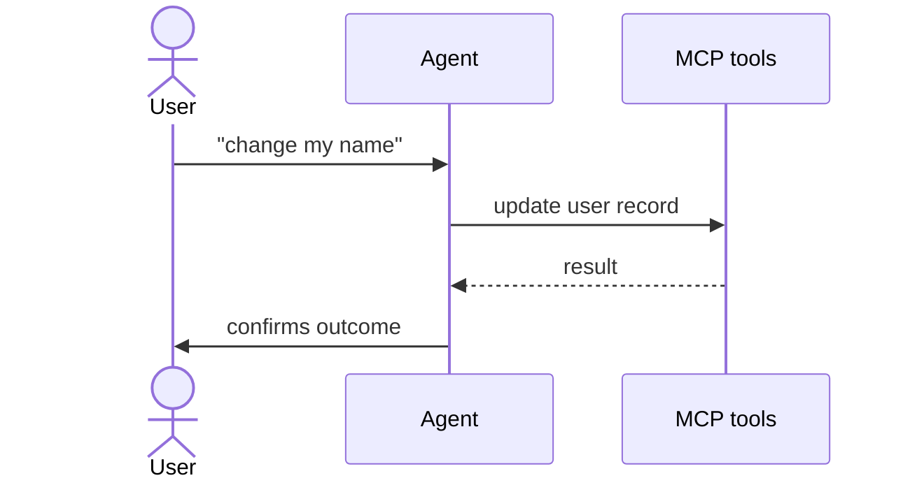

# Update profile

<!-- AGENT id="prose" -->
The user opens their profile page, edits one or both of name and email, and submits. The agent's job is to take the user-stated change, validate that the user is authenticated, and perform the write intent registered in the glossary. The flow is single-step and idempotent -- re-running with the same values is safe.
<!-- /AGENT -->

## Entry point

`app/profile/page.tsx` — reached when the user navigates to `/profile` in the browser

## How the agent handles this

1. Confirm the user is signed in. If not, ask them to sign in first and stop.
2. Confirm which field(s) the user wants to change and the new value(s).
3. Perform [update user record](../glossary.md#update-user-record) with the user's id and the changed fields.
4. On success, summarise what was changed back to the user.
5. On failure, show the error returned by the tool and offer to retry once.

## Decision points

- **User did not provide a new value** → ask for it before performing the write intent
- **User asked to change a field the intent does not accept** → tell the user that field cannot be changed here
- **Two retries failed** → stop retrying and ask the user whether to surface a support request

## Sequence

## Failure modes

| What happens | What it means | What to do |
|---|---|---|
| Tool returns 401 | Bearer token missing or expired | Ask the user to sign in again |
| Tool returns 403 | User trying to update someone else | Refuse and explain the boundary |
| Tool returns 422 | Validation failed (e.g., bad email) | Echo the error and ask for a fix |
| Tool returns 5xx | Backend transient failure | Retry once with backoff, then surface |

## Intents used

- [update user record](../glossary.md#update-user-record) — write

<!-- HUMAN id="extra" -->
<!-- /HUMAN -->

## Unresolved

None.
