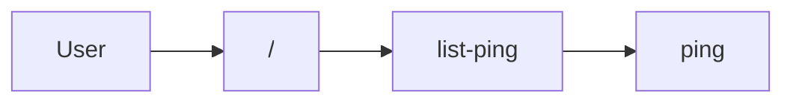

# sample-sveltekit — flow map

<!-- AGENT id="summary" -->
TODO: one-paragraph summary of sample-sveltekit.
<!-- /AGENT -->

## Reading order for agents

1. Load APP.md once per session.
2. For "tell me about X" / behavior questions → load `flows/<id>.md`
   matching the intent table below.
3. For "I need to do Y" / capability questions → load
   `capabilities/<name>.md`.
4. For unfamiliar terms → consult `glossary.md`.

## Overview

## Intent → flow

| User intent | Flow |
|---|---|
| list ping | [view-home](flows/view-home.md) |

## Flows

| id | file | what it does |
|---|---|---|
| view-home | [flows/view-home.md](flows/view-home.md) | TODO: one-line summary |

## Capabilities

| name | file | proposed tools |
|---|---|---|
| ping | [capabilities/ping.md](capabilities/ping.md) | 1 |

## Note on tool names

Tool names referenced anywhere in this wiki are *proposed* — derived
from frontend call sites. The actual MCP server does not exist yet. See
[`tools-proposed.json`](tools-proposed.json) for the full
machine-readable list intended for whoever wires up the MCP server.

Flow files do not name proposed tools at all; they reference intents
defined in [`glossary.md`](glossary.md), which is the single
indirection layer that maps intents to currently-proposed tool names.
When tools are renamed, only the glossary updates.

## Unresolved

None.

<!-- HUMAN id="agents-extra" -->
<!-- /HUMAN -->
