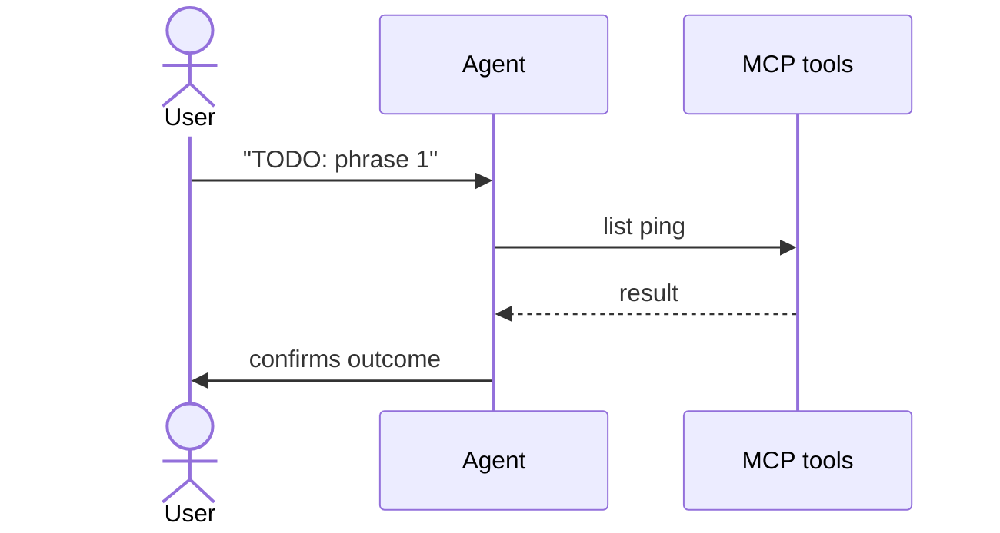

# View Home

<!-- AGENT id="prose" -->
TODO: 2-4 sentence summary of this flow's purpose, agent behaviour, and any idempotence properties.
<!-- /AGENT -->

## Entry point

`src/routes/+page.svelte` — TODO: how the user reaches this entry

## How the agent handles this

1. Perform [list ping](../skills/list-ping.md).

## Decision points

(none documented yet)

## Sequence

## Failure modes

| What happens | What it means | What to do |
|---|---|---|
| Tool returns 401 | auth missing/expired | ask the user to sign in again |
| Tool returns non-2xx | operation failed | surface the error to the user |

## Skills used

- [list ping](../skills/list-ping.md) — read

<!-- HUMAN id="extra" -->
<!-- /HUMAN -->

## Unresolved

None.
