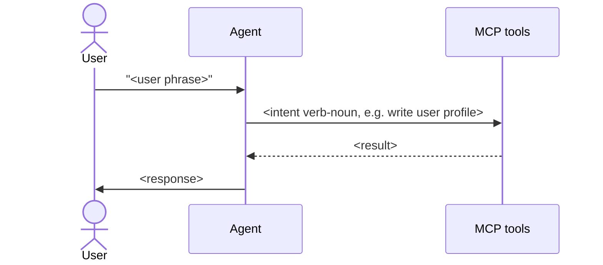

# Output schemas

Exact shapes for every file the skill produces. Treat as a contract: the
templates in `assets/templates/` and the lint rules in
`references/lint-contract.md` enforce these schemas.

## `AGENTS.md`

````markdown
---
schema_version: 1
generated_by: flow-map-compiler
generated_at: <ISO8601>
generated_from_sha: <git-sha>
app_name: <name>
stack: { framework: <adapter-id>, version: "<v>", router: app|pages|both|none, language: ts|js }
counts: { flows: <n>, capabilities: <n>, proposed_tools: <n> }
freshness: { last_verified: <ISO8601>, staleness_check: weekly }
files:
  app_context: APP.md
  glossary: glossary.md
  flows_dir: flows/
  capabilities_dir: capabilities/
  proposed_tools: tools-proposed.json
---

# <App name> — flow map

<one-paragraph LLM-authored summary of the app>

## Reading order for agents

1. Load APP.md once per session.
2. For "tell me about X" / behavior questions → load flows/<id>.md
   matching the intent table.
3. For "I need to do Y" / capability questions → load
   capabilities/<name>.md.
4. For unfamiliar terms → consult glossary.md.

## Overview


## Intent → flow

| User intent | Flow |
|---|---|

## Flows

| id | file | what it does |
|---|---|---|

## Capabilities

| name | file | proposed tools |
|---|---|---|

## Note on tool names

Tool names referenced throughout this wiki are *proposed* — derived from
frontend call sites. The actual MCP server does not exist yet. See
`tools-proposed.json` for the full machine-readable list.

## Unresolved

<count and pointer to flows with unresolved call sites>
````

## `APP.md`

````markdown
---
schema_version: 1
framework: { name: <adapter-id>, version: "<v>", router: app|pages|both|none }
api_clients: [<list>]
api_base_url: { source: env|hardcoded, name: <ENV_VAR>, default: "<url>" }
auth: { type: bearer|cookie|none, token_source: <where>, refresh: <how> }
providers: [<name>, <scope>]
---

# App context

<!-- AGENT id="overview" -->
<2–3 sentences: what this app is>
<!-- /AGENT -->

## Stack
<bullets>

## Invariants
<numbered list — properties true everywhere in the system>

## Auth model
<where tokens come from, how attached, refresh, 401 behavior>

## Conventions
<patterns repeated across flows so flow files don't repeat them>

## Provider hierarchy
<optional Mermaid flowchart TD if non-trivial>

## Boundaries
<numbered list — things the agent must never do>

<!-- HUMAN id="extra-context" -->
<!-- /HUMAN -->
````

## `glossary.md`

The glossary is the **indirection layer** that decouples flows from
proposed tool names. Each row is anchored on a stable intent key
(`{#<intent>}`) so flow files can link to it. When the MCP server lands
and tools get named, only the "Proposed tool" column changes — flow files
stay byte-identical.

````markdown
---
schema_version: 1
---

# Glossary

| Intent | User phrases | Capability | Proposed tool |
|---|---|---|---|
| <kebab-case-id> | "<phrase>", "<phrase>" | [<name>#<anchor>](capabilities/<name>.md#<anchor>) | `<tool.name>` |

## Intent anchors

Each intent below carries an explicit anchor so flow files can link to
`glossary.md#<intent>`.

### write user profile {#write-user-profile}

- Capability: [`capabilities/users.md#users-update`](capabilities/users.md#users-update)
- Proposed tool: `users.update`
- Role: write

<repeat per intent>

<!-- HUMAN id="glossary-additions" -->
<!-- /HUMAN -->
````

## `flows/<id>.md`

Flow files are tool-name-free. They reference **intent keys** that resolve
through the glossary. The glossary's "Proposed tool" column is the only
dynamic part — when tools get renamed, flows do not change.

````markdown
---
schema_version: 1
id: <kebab-case>
name: <human-readable>
description: "Use when <trigger condition>"
intent: "<one sentence>"
user_phrases:
  - "<verbatim phrase a user might say>"
  - "..."
entry: <relative source path>
trigger: <UI event or condition>
preconditions:
  - <numbered system state requirement>
intents_used:
  - intent: <kebab-case-intent>
    role: load|read|write|side-effect
    glossary_ref: ../glossary.md#<intent>
postconditions:
  - <what's true after>
side_effects: [<list>]
related_flows: [<id>, ...]
confidence: high|medium|low
---

# <Flow name>

<!-- AGENT id="prose" -->
<2–4 sentences>
<!-- /AGENT -->

## Entry point
<file path + how it's reached>

## How the agent handles this

1. <step referring to intents as markdown links to glossary anchors,
   e.g. [write user profile](../glossary.md#write-user-profile). Never
   name a tool, never show HTTP method or URL path.>
2. ...

## Decision points

- **<condition>** → <what to do>

## Sequence



## Failure modes

| What happens | What it means | What to do |
|---|---|---|

## Intents used
<bullet list of intent keys, each linking to
 glossary.md#<intent>>

<!-- HUMAN id="extra" -->
<!-- /HUMAN -->

## Unresolved
<list of call sites that couldn't be statically resolved; empty if none>
````

## `capabilities/<name>.md`

````markdown
---
schema_version: 1
capability: <name>
summary: "<one sentence>"
tools:
  - tool: <tool.name>
    proposed: true
    does: "<one-line semantic description>"
    method: GET|POST|PUT|PATCH|DELETE|HEAD|OPTIONS
    path: "<path with {params}>"
    auth: bearer|cookie|none
    confidence: high|medium|low
    source: <relative source file>:<line>
flows_using_this: [<flow-id>, ...]
---

# <Capability name>

<!-- AGENT id="overview" -->
<what this resource represents in the domain; constraints and invariants>
<!-- /AGENT -->

## Concepts the agent must know
<bullets>

## When to reach for which tool

- "<user intent phrase>" → `<tool.name>`

---

## <tool.name>  {#<anchor>}

**Proposed tool name:** `<tool.name>` (proposed — no MCP server yet)
**HTTP:** `METHOD /path/with/{params}`
**Auth:** bearer|cookie|none
**Confidence:** high|medium|low
**Source:** `<file>:<line>`

**Path params:** <list or none>
**Query params:** <list or none>
**Body shape:** <typed shape or `unknown`>
**Response shape:** <typed shape or `unknown`>

**When to call it:** <2–3 user intent phrases>

**Used by flows:** <links to flow files>

---

## Things this capability cannot do
<bullets>

<!-- HUMAN id="notes" -->
<!-- /HUMAN -->
````

## `tools-proposed.json`

````json
{
  "schema_version": 1,
  "generated_by": "flow-map-compiler",
  "generated_at": "<ISO8601>",
  "generated_from_sha": "<git-sha>",
  "naming_convention": "dotted-lower-camel",
  "tools": [
    {
      "proposed_name": "users.update",
      "method": "PATCH",
      "path": "/api/users/{id}",
      "path_params": [{ "name": "id", "type": "string", "required": true }],
      "query_params": [],
      "body_shape": { "name": "string", "email": "string" },
      "response_shape": "User",
      "auth": "bearer",
      "capability_file": "capabilities/users.md",
      "anchor": "users-update",
      "source": [
        { "file": "lib/api/users.ts", "line": 17 }
      ],
      "used_by_flows": ["update-profile"],
      "confidence": "high",
      "openapi_operation_id": "updateUser"
    }
  ],
  "unresolved": [
    {
      "where": "components/Search.tsx:88",
      "snippet": "fetch(`/api/search?q=${query}&type=${type}`)",
      "reason": "type variable not statically resolvable"
    }
  ]
}
````
